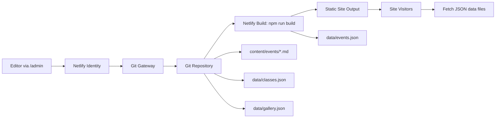

# Seattle Tabla Institute Website

## Summary
Static, mobile-first website for Seattle Tabla Institute (STI) with a lightweight
CMS (Decap CMS) for non-developer updates. Content for events, classes, and the
media gallery is managed via Markdown and JSON files in the repo and deployed
on Netlify.

## Overview
- Static HTML/CSS/JS site with fast load times and mobile-friendly layouts.
- Decap CMS (Netlify CMS) enables non-developers to update:
  - Events (Markdown)
  - Class schedules/pricing (JSON)
  - Gallery photos and YouTube links (JSON)
- Netlify build script compiles event Markdown into `data/events.json`.
- Netlify Identity + Git Gateway handle editor authentication and commits.

## Architecture


## Local Setup
Install dependencies:
```bash
npm install
```

Build event data:
```bash
npm run build
```

Preview locally:
```bash
python3 -m http.server
```
Open `http://localhost:8000`.

## Content Locations
- Events (Markdown): `content/events/`
- Events output (JSON): `data/events.json` (generated)
- Class data (JSON): `data/classes.json`
- Gallery data (JSON): `data/gallery.json`
- CMS config: `admin/config.yml`
- CMS entry: `admin/index.html`

## Netlify CMS Setup
1) Enable Netlify Identity.
2) Enable Git Gateway.
3) Invite editors.
4) Visit `/admin/` on the deployed site and log in.

## Notes
- Update PayPal links when ready.
- Replace gallery placeholders in `assets/uploads/`.
