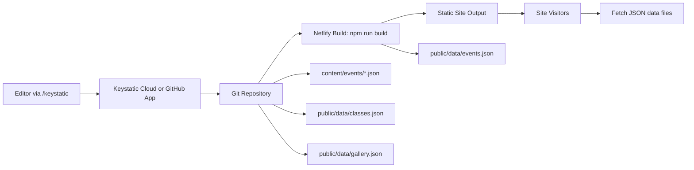

# Seattle Tabla Institute Website

## Summary
Static, mobile-first website for Seattle Tabla Institute (STI) with a lightweight
Keystatic CMS for non-developer updates. Content for events, classes, and the
media gallery is managed via JSON files in the repo and deployed on Netlify.

## Overview
- Static HTML/CSS/JS site with fast load times and mobile-friendly layouts.
- Keystatic CMS enables non-developers to update:
  - Events (JSON + Markdoc body)
  - Class schedules/pricing (JSON)
  - Gallery photos and YouTube links (JSON)
- Build script compiles event JSON into `public/data/events.json`.
- Keystatic can use GitHub or Keystatic Cloud for editor authentication and commits.

## Architecture


## Local Setup
Install dependencies:
```bash
npm install
```

Build event data:
```bash
npm run build
```

Preview locally:
```bash
npm run dev
```
Open `http://localhost:4321`.

## Content Locations
- Events (JSON + Markdoc): `content/events/`
- Events output (JSON): `public/data/events.json` (generated)
- Class data (JSON): `public/data/classes.json`
- Gallery data (JSON): `public/data/gallery.json`
- CMS config: `keystatic.config.ts`

## Keystatic Setup
Keystatic supports local mode for dev, plus GitHub or Keystatic Cloud for editors.

1) Start local editing at `http://localhost:4321/keystatic`.
2) For GitHub mode, set `KEYSTATIC_STORAGE_KIND=github` and configure a GitHub App.
3) For Keystatic Cloud, set `KEYSTATIC_STORAGE_KIND=cloud` and `KEYSTATIC_CLOUD_PROJECT`.

## Notes
- Update PayPal links when ready.
- Replace gallery placeholders in `public/assets/uploads/`.
